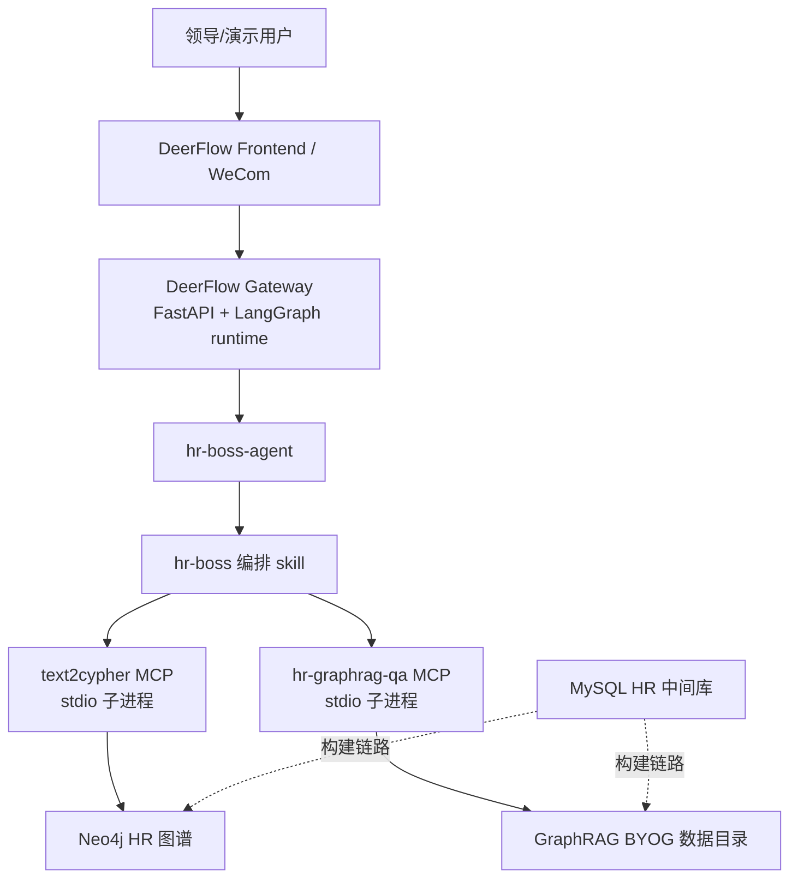

# HR Boss Agent 服务器部署文档

本文档面向 `hr-boss-agent` 的服务器部署。当前实现不是把 HR 能力写进 DeerFlow 核心，而是让 DeerFlow Gateway 作为对话运行时和 MCP Host，通过 `hr-boss` 编排 skill 路由到两个专业 MCP：

- `text2cypher`：连接 Neo4j，回答人数、名单、排名、平均值、占比、筛选等精确查询。
- `hr-graphrag-qa`：读取 GraphRAG 索引数据，回答证据片段、人员/岗位/部门局部事实、组织画像、趋势和探索分析。

MySQL 当前不在 `hr-boss-agent` 在线问答主链路里直接使用，但它是从 Excel 重建 Neo4j 和 GraphRAG 数据的中间库。`xiyan-text2sql` 仍然只是评测对账通道，纯领导问答部署可以不启用。

## 1. 部署拓扑



当前源码依据：

- Agent 配置：`backend/.deer-flow/agents/hr-boss-agent/config.yaml`
- Agent 提示：`backend/.deer-flow/agents/hr-boss-agent/SOUL.md`
- Text2Cypher 业务口径：`backend/.deer-flow/agents/hr-boss-agent/text2cypher-profile.md`
- 编排 skill：`skills/custom/hr-boss/SKILL.md`
- MCP 注册：`extensions_config.json`
- Text2Cypher 启动包装器：`scripts/run_text2cypher_mcp.py`
- GraphRAG 启动包装器：`scripts/run_graphrag_mcp.py`

## 2. 推荐部署方案（升级版）

补充 Excel 重建链路后，最佳方案不再是“手工准备 Neo4j 和 GraphRAG 数据后启动服务”，而是拆成两个阶段：

1. **数据重建阶段**：只在首次部署或替换源 Excel 后执行。该阶段会清 MySQL、清 Neo4j、删除 GraphRAG 生成目录，然后从 `基本信息_filled_new.xlsx` 全量重建 MySQL、Neo4j 和 GraphRAG BYOG 数据。
2. **运行服务阶段**：平时只启动 DeerFlow、MCP、Neo4j、MySQL 等服务，消费已经构建好的图谱和 GraphRAG 数据。不要在每次服务重启时自动重建数据。

仓库已经新增一套 HR Boss Docker 部署骨架：

- `deployment/hr-boss/.env.example`
- `deployment/hr-boss/extensions_config.docker.json`
- `deployment/hr-boss/Dockerfile.data-builder`
- `deployment/hr-boss/rebuild_hr_kg.py`
- `deployment/hr-boss/README.md`
- `docker/docker-compose.hr-boss.yaml`

推荐用 `docker/docker-compose.yaml` 作为 DeerFlow 基座，再叠加 `docker/docker-compose.hr-boss.yaml`：

```bash
set -a
. deployment/hr-boss/.env
set +a

# 首次部署或 Excel 更新后执行：破坏性重建数据
docker compose -p hr-boss \
  -f docker/docker-compose.yaml \
  -f docker/docker-compose.hr-boss.yaml \
  --profile rebuild run --build --rm hr-data-builder

# 平时启动运行时服务
docker compose -p hr-boss \
  -f docker/docker-compose.yaml \
  -f docker/docker-compose.hr-boss.yaml \
  up -d --build nginx frontend gateway neo4j mysql
```

模块划分如下：

| 模块 | 推荐形态 | 说明 |
| --- | --- | --- |
| DeerFlow 前后端 | Docker Compose | 仓库已有 `docker/docker-compose.yaml`，入口端口默认 `2026`。 |
| Gateway | Docker 容器 | Gateway 会按 `extensions_config.json` 拉起 stdio MCP 子进程。 |
| Text2Cypher MCP | Gateway 容器内 stdio 子进程 | 通过 `TEXT2CYPHER_REPO` 挂载到 `/opt/hr-mcp/text2cypher`。 |
| GraphRAG MCP | Gateway 容器内 stdio 子进程 | 通过 `GRAPHRAG_MCP_REPO` 挂载到 `/opt/hr-mcp/graphrag-mcp`。 |
| hr-data-builder | 只在 `rebuild` profile 中运行 | 从 Excel 全量重建 MySQL、Neo4j、GraphRAG。运行完退出。 |
| Neo4j | Compose 服务 | Text2Cypher 在线查询和数据重建共同使用。 |
| MySQL | Compose 服务 | 数据重建阶段必须使用；运行时可保留以便排障和后续增量构建。 |

这仍然是“准一键”方案，因为 `text2cypher`、`graphrag-mcp`、BYOG GraphRAG 项目代码目前不在 DeerFlow 仓库内。服务器上仍需准备这些外部代码目录和 Linux `.venv`。如果要做到只凭 DeerFlow 仓库、Excel 和 `.env` 完全一键，需要进一步把 Text2Cypher MCP 和 GraphRAG MCP 镜像化，或把外部仓库 vendor 进部署包。

## 3. 服务器目录约定

下面用 Linux 服务器路径举例，实际可按你的机器调整：

```text
/opt/deer-flow                         # 本仓库
/opt/hr-mcp/text2cypher                # Text2Cypher MCP 仓库
/opt/hr-mcp/graphrag-mcp               # GraphRAG MCP 仓库
/data/hr/source                        # 基本信息_filled_new.xlsx + import_compressed.py
/data/hr/graphrag/byog_graphrag        # GraphRAG 索引数据
/data/deer-flow                        # DeerFlow 运行态数据 DEER_FLOW_HOME
/data/neo4j                            # Neo4j 数据卷
/data/mysql                            # MySQL 数据卷
```

## 4. 基础环境

宿主机建议准备：

- Docker 和 Docker Compose plugin。
- Git。
- Python 3.12 和 `uv`，用于初始化 MCP 仓库虚拟环境。
- Node.js 22 和 pnpm，仅在原生部署前端时需要。
- 能访问大模型服务的网络，以及对应 API Key。

DeerFlow 后端 Dockerfile 使用 Python 3.12，前端 Dockerfile 使用 Node 22。

## 5. 准备数据服务

### 5.1 源 Excel

当前数据源可以收敛为一个 Excel：

```text
C:\Users\IT\Desktop\hr知识图谱\基本信息_filled_new.xlsx
```

服务器部署时把它复制到：

```text
/data/hr/source/基本信息_filled_new.xlsx
```

同时复制当前用于 Excel -> MySQL 的导入脚本：

```text
C:\Users\IT\Desktop\hr知识图谱\import_compressed.py
```

到：

```text
/data/hr/source/import_compressed.py
```

### 5.2 MySQL

补充 Excel 重建链路后，MySQL 不再只是可选对账依赖，而是**数据构建阶段的中间库**。`hr-data-builder` 会先清空 MySQL 目标库，再执行 `import_compressed.py` 把 Excel 导入压缩表。

运行时问答主链路仍然不直接访问 MySQL；Text2Cypher 访问 Neo4j，GraphRAG MCP 访问 GraphRAG 数据目录。

### 5.3 Neo4j

Text2Cypher 在线查询依赖 Neo4j。升级后的 Docker overlay 已经包含 `neo4j` 服务。数据重建阶段会清空并重建 Neo4j 图谱；运行阶段只读取该图谱。

### 5.4 GraphRAG 数据

GraphRAG MCP 通过 `GRAPHRAG_DATA_ROOT` 读取已经构建好的 BYOG 数据目录。升级后的 `hr-data-builder` 会删除 `cache`、`hr_agent`、`logs`、`output` 等生成目录，再执行 BYOG `strict-sync-all`。

注意：`scripts/run_graphrag_mcp.py` 只根据 `GRAPHRAG_MCP_REPO` 加载 MCP 代码，数据目录由 `extensions_config.json` 里的 `GRAPHRAG_DATA_ROOT` 决定。

## 6. 准备代码和密钥

```bash
cd /opt
git clone <your-deer-flow-repo> deer-flow
cd /opt/deer-flow

cp .env.example .env
cp frontend/.env.example frontend/.env
cp config.example.yaml config.yaml
cp deployment/hr-boss/extensions_config.docker.json extensions_config.hr-boss.json
cp deployment/hr-boss/.env.example deployment/hr-boss/.env
```

在 `deployment/hr-boss/.env` 中至少配置：

```dotenv
# DeerFlow / hr-boss-agent 模型
DASHSCOPE_API_KEY=your_model_api_key

# GraphRAG MCP
ALIBABA_API_KEY=your_alibaba_api_key

# 源数据和外部代码目录
HR_KG_SOURCE_DIR=/data/hr/source
HR_EXCEL_FILE=基本信息_filled_new.xlsx
HR_IMPORT_SCRIPT_FILE=import_compressed.py
TEXT2CYPHER_REPO=/opt/hr-mcp/text2cypher
GRAPHRAG_MCP_REPO=/opt/hr-mcp/graphrag-mcp
BYOG_GRAPHRAG_ROOT=/data/hr/graphrag/byog_graphrag

# MySQL 构建中间库
MYSQL_ROOT_PASSWORD=replace_with_mysql_root_password
MYSQL_DATABASE=hr
MYSQL_USER=hr
MYSQL_PASSWORD=replace_with_mysql_password

# Text2Cypher / BYOG -> Neo4j
TEXT2CYPHER_NEO4J_URI=bolt://neo4j:7687
TEXT2CYPHER_NEO4J_USERNAME=neo4j
TEXT2CYPHER_NEO4J_PASSWORD=your_password
TEXT2CYPHER_NEO4J_DATABASE=neo4j

# DeerFlow
DEER_FLOW_REPO_ROOT=/opt/deer-flow
DEER_FLOW_HOME=/data/deer-flow
DEER_FLOW_CONFIG_PATH=/opt/deer-flow/config.yaml
DEER_FLOW_EXTENSIONS_CONFIG_PATH=/opt/deer-flow/extensions_config.hr-boss.json
BETTER_AUTH_SECRET=replace_with_random_hex

# 企业微信入口，可选
WECOM_BOT_ID=your_wecom_bot_id
WECOM_BOT_SECRET=your_wecom_bot_secret
```

如果 Neo4j 不使用 overlay 中的 `neo4j` 服务，而是连接外部 Neo4j，`TEXT2CYPHER_NEO4J_URI` 写真实内网地址，例如 `bolt://10.0.0.12:7687`。

## 7. 配置 `hr-boss-agent`

确认 `backend/.deer-flow/agents/hr-boss-agent/config.yaml` 保持以下关键点：

```yaml
name: hr-boss-agent
model: deepseek-v4-pro
skills:
  - hr-boss
mcp_servers:
  - hr-graphrag-qa
  - text2cypher
allowed_tools:
  - ask_clarification
  - text2cypher_answer_question
  - hr-graphrag-qa_query_basic
  - hr-graphrag-qa_query_local
  - hr-graphrag-qa_query_global
  - hr-graphrag-qa_query_drift
```

不要把 Text2Cypher 的低层调试工具加进 `allowed_tools`。领导问答只暴露 `text2cypher_answer_question`。

## 8. 配置 MCP

### 8.1 原生部署示例

如果 DeerFlow 直接运行在宿主机，`extensions_config.json` 可以写宿主机路径：

```json
{
  "mcpServers": {
    "hr-graphrag-qa": {
      "enabled": true,
      "type": "stdio",
      "command": "/opt/hr-mcp/graphrag-mcp/.venv/bin/python",
      "args": ["/opt/deer-flow/scripts/run_graphrag_mcp.py"],
      "env": {
        "GRAPHRAG_MCP_REPO": "/opt/hr-mcp/graphrag-mcp",
        "GRAPHRAG_DATA_ROOT": "/data/hr/graphrag/byog_graphrag",
        "ALIBABA_API_KEY": "$ALIBABA_API_KEY"
      },
      "description": "Fixed HR GraphRAG QA MCP server"
    },
    "text2cypher": {
      "enabled": true,
      "type": "stdio",
      "command": "/opt/hr-mcp/text2cypher/.venv/bin/python",
      "args": ["/opt/deer-flow/scripts/run_text2cypher_mcp.py"],
      "env": {
        "TEXT2CYPHER_REPO": "/opt/hr-mcp/text2cypher",
        "TEXT2CYPHER_PROFILE_PATH": "/opt/deer-flow/backend/.deer-flow/agents/hr-boss-agent/text2cypher-profile.md",
        "TEXT2CYPHER_NEO4J_URI": "$TEXT2CYPHER_NEO4J_URI",
        "TEXT2CYPHER_NEO4J_USERNAME": "$TEXT2CYPHER_NEO4J_USERNAME",
        "TEXT2CYPHER_NEO4J_PASSWORD": "$TEXT2CYPHER_NEO4J_PASSWORD",
        "TEXT2CYPHER_NEO4J_DATABASE": "$TEXT2CYPHER_NEO4J_DATABASE",
        "TEXT2CYPHER_OPENAI_API_KEY": "$DASHSCOPE_API_KEY",
        "TEXT2CYPHER_OPENAI_BASE_URL": "https://api.deepseek.com",
        "TEXT2CYPHER_OPENAI_MODEL": "deepseek-v4-pro",
        "TEXT2CYPHER_TRACE_ENABLED": "true"
      },
      "description": "Local Text2Cypher engine via MCP"
    }
  },
  "skills": {}
}
```

### 8.2 Docker 部署示例

Docker 生产 compose 默认只挂载 DeerFlow 自身目录。新增的 `docker/docker-compose.hr-boss.yaml` 已经负责：

- 增加 `mysql` 服务。
- 增加 `neo4j` 服务。
- 增加只在 `rebuild` profile 运行的 `hr-data-builder` 服务。
- 给 `gateway` 追加 Text2Cypher、GraphRAG MCP、GraphRAG 数据目录挂载。
- 给 `gateway` 注入容器内 Neo4j 地址 `bolt://neo4j:7687`。

Docker 版 MCP 配置使用：

```text
deployment/hr-boss/extensions_config.docker.json
```

部署时建议复制到不被 Git 管理的运行时路径：

```bash
cp deployment/hr-boss/extensions_config.docker.json extensions_config.hr-boss.json
```

并在 `deployment/hr-boss/.env` 中设置：

```dotenv
DEER_FLOW_EXTENSIONS_CONFIG_PATH=/opt/deer-flow/extensions_config.hr-boss.json
```

## 9. 配置 DeerFlow 主配置

`config.yaml` 需要确认：

```yaml
models:
  - name: deepseek-v4-pro
    use: deerflow.models.patched_deepseek:PatchedChatDeepSeek
    model: deepseek-v4-pro
    api_base: https://api.deepseek.com
    api_key: $DASHSCOPE_API_KEY

database:
  backend: sqlite
  sqlite_dir: .deer-flow/data

channels:
  langgraph_url: http://localhost:8001/api
  gateway_url: http://localhost:8001
  session:
    assistant_id: hr-boss-agent
    config:
      recursion_limit: 100
    context:
      thinking_enabled: true
      is_plan_mode: false
      subagent_enabled: false
  wecom:
    enabled: true
    bot_id: $WECOM_BOT_ID
    bot_secret: $WECOM_BOT_SECRET
    working_message: 正在查询 HR 数据，请稍候...
```

单机首版可以用 SQLite。多实例生产部署再切 PostgreSQL，并设置 `DATABASE_URL` 和 `UV_EXTRAS=postgres`。

## 10. 初始化 MCP 仓库

以下命令在宿主机执行，具体依赖安装以各 MCP 仓库自己的 README 为准：

```bash
cd /opt/hr-mcp/text2cypher
uv sync

cd /opt/hr-mcp/graphrag-mcp
uv sync
```

快速检查启动包装器：

```bash
cd /opt/deer-flow

GRAPHRAG_MCP_REPO=/opt/hr-mcp/graphrag-mcp \
GRAPHRAG_DATA_ROOT=/data/hr/graphrag/byog_graphrag \
ALIBABA_API_KEY=your_alibaba_api_key \
/opt/hr-mcp/graphrag-mcp/.venv/bin/python scripts/run_graphrag_mcp.py
```

```bash
cd /opt/deer-flow

TEXT2CYPHER_REPO=/opt/hr-mcp/text2cypher \
TEXT2CYPHER_PROFILE_PATH=/opt/deer-flow/backend/.deer-flow/agents/hr-boss-agent/text2cypher-profile.md \
TEXT2CYPHER_NEO4J_URI=bolt://127.0.0.1:7687 \
TEXT2CYPHER_NEO4J_USERNAME=neo4j \
TEXT2CYPHER_NEO4J_PASSWORD=your_password \
TEXT2CYPHER_NEO4J_DATABASE=neo4j \
TEXT2CYPHER_OPENAI_API_KEY=your_model_api_key \
/opt/hr-mcp/text2cypher/.venv/bin/python scripts/run_text2cypher_mcp.py
```

这两个命令是 stdio MCP 服务，正常情况下会等待 MCP 客户端输入，不一定主动打印成功信息。只要没有立刻报 `repo does not exist`、`src/ not found`、依赖导入失败或 Neo4j 配置错误，就说明启动路径基本正确。检查后 `Ctrl+C` 退出。

## 11. 数据重建与启动

### 11.1 加载部署环境变量

```bash
cd /opt/deer-flow

set -a
. deployment/hr-boss/.env
set +a
```

### 11.2 首次部署或 Excel 更新后：重建数据

这是破坏性步骤，会清 MySQL、清 Neo4j、删除 GraphRAG 生成目录，然后从 Excel 全量重建。

```bash
ls -la /data/hr/source

docker compose -p hr-boss \
  -f docker/docker-compose.yaml \
  -f docker/docker-compose.hr-boss.yaml \
  --profile rebuild run --build --rm hr-data-builder
```

重建完成后，Neo4j 和 GraphRAG 数据目录就成为运行时数据源。

### 11.3 平时启动运行时服务

```bash
docker compose -p hr-boss \
  -f docker/docker-compose.yaml \
  -f docker/docker-compose.hr-boss.yaml \
  up -d --build nginx frontend gateway neo4j mysql
```

查看日志：

```bash
docker compose -p hr-boss -f docker/docker-compose.yaml -f docker/docker-compose.hr-boss.yaml logs -f gateway
docker compose -p hr-boss -f docker/docker-compose.yaml -f docker/docker-compose.hr-boss.yaml logs -f hr-data-builder
```

停止：

```bash
docker compose -p hr-boss -f docker/docker-compose.yaml -f docker/docker-compose.hr-boss.yaml down
```

### 11.4 原生启动

```bash
cd /opt/deer-flow
make install
make start-daemon
```

原生生产建议再用 systemd 或进程守护工具托管 `make start` 对应的 Gateway/Frontend 进程，避免 SSH 退出后服务停止。

## 12. 验证清单

1. DeerFlow 网页可访问：

```bash
curl -f http://127.0.0.1:2026/health
```

2. MCP 配置可读，并且敏感值被掩码：

```bash
curl -s http://127.0.0.1:2026/api/mcp/config
```

3. 在 UI 里选择或进入 `hr-boss-agent`，提一个 Text2Cypher 问题：

```text
福建火炬电子科技股份有限公司平均年龄是多少？
```

预期：走精确查询；如果年龄字段不可用，应说明数据限制，不要改走 GraphRAG 估算。

4. 提一个 GraphRAG 问题：

```text
福建火炬电子科技股份有限公司的人才结构有什么特点？
```

预期：走 GraphRAG global，回答组织画像、结构特点和证据限制。

5. 如启用企业微信，重启 Gateway 后观察日志应出现渠道启动信息，并在企业微信提同样问题验证回包。

## 13. 常见故障

| 现象 | 重点检查 |
| --- | --- |
| Gateway 启动后 MCP 工具不可用 | `extensions_config.json` 中对应 MCP 是否 `enabled: true`；`hr-boss-agent/config.yaml` 是否列入 `mcp_servers`；Gateway 日志里是否有 stdio 子进程启动错误。 |
| Docker 内 MCP 路径不存在 | `gateway.volumes` 是否挂载了 MCP 仓库和数据目录；`extensions_config.json` 是否写容器内路径，不是宿主机独有路径。 |
| `Excel file does not exist` | 检查 `deployment/hr-boss/.env` 中的 `HR_KG_SOURCE_DIR` 和 `HR_EXCEL_FILE`；宿主机目录会挂载为容器内 `/app/hr-kg-source`。 |
| Text2Cypher 查询失败 | Neo4j 地址、用户名、密码、数据库名；Neo4j 是否允许 Bolt 访问；HR 图谱是否已导入。 |
| GraphRAG 回答无证据 | `GRAPHRAG_DATA_ROOT` 是否指向当前 BYOG 数据；数据目录是否挂入容器；GraphRAG MCP 仓库依赖是否安装。 |
| 领导问答输出底层 Cypher 或 JSON | 检查 `hr-boss-agent/config.yaml` 的 `allowed_tools`，不要暴露低层 Text2Cypher 工具；检查 `skills/custom/hr-boss/SKILL.md` 是否仍是唯一编排合同。 |
| 企业微信无响应 | `.env` 中 `WECOM_BOT_ID/WECOM_BOT_SECRET`；`config.yaml.channels.wecom.enabled`；`channels.session.assistant_id` 是否为 `hr-boss-agent`；Gateway 是否重启。 |
| MySQL 不通但 hr-boss 仍可问答 | 这是正常的，当前主链路不直接访问 MySQL。只有构建/对账/XiYan 链路需要 MySQL。 |

## 14. 上线前检查

- `text2cypher` MCP 能被 Gateway 拉起。
- `hr-graphrag-qa` MCP 能被 Gateway 拉起。
- Neo4j 内 HR 图谱数据和 `text2cypher-profile.md` 使用同一业务口径。
- `GRAPHRAG_DATA_ROOT` 指向本次演示要用的 GraphRAG 数据快照。
- `hr-boss-agent` 只挂载 `hr-boss` skill、`hr-graphrag-qa`、`text2cypher`。
- 精确查询问题能回答或明确说明限制。
- GraphRAG 画像问题能回答并说明证据边界。
- 如走企业微信，已经通过企业微信原通道演练至少一次。


## 部署：

对，大方向是对的：**这两个命令就是部署的两个核心动作**。

但更准确地说，不是“把代码复制到服务器后立刻运行这两个命令就一定成功”，而是：

1. 先把 DeerFlow 仓库放到服务器，比如 `/opt/deer-flow`
2. 准备并填写这些文件：
   `config.yaml`、`frontend/.env`、`extensions_config.hr-boss.json`、`deployment/hr-boss/.env`
3. 把 Excel 和导入脚本放到 `.env` 指定的位置：
   `/data/hr/source/基本信息_filled_new.xlsx`
   `/data/hr/source/import_compressed.py`
4. 服务器上还要有外部 MCP 代码目录：
   `/opt/hr-mcp/text2cypher`
   `/opt/hr-mcp/graphrag-mcp`
   `/data/hr/graphrag/byog_graphrag`
5. `text2cypher` 和 `graphrag-mcp` 运行时还需要准备好 Linux 环境里的 `.venv`，因为 Gateway 会用它们的 `.venv/bin/python` 拉起 MCP 子进程。

然后运行你贴的两个命令。

第一个命令：

```bash
docker compose -p hr-boss \
  -f docker/docker-compose.yaml \
  -f docker/docker-compose.hr-boss.yaml \
  --profile rebuild run --build --rm hr-data-builder
```

作用是**破坏性重建数据**：清 MySQL、清 Neo4j、清 GraphRAG 生成目录，然后从 Excel 全量导入。这个只在首次部署或 Excel 更新后跑，不要每次重启都跑。

第二个命令：

```bash
docker compose -p hr-boss \
  -f docker/docker-compose.yaml \
  -f docker/docker-compose.hr-boss.yaml \
  up -d --build nginx frontend gateway neo4j mysql
```

作用是启动正式运行服务。

还有一个容易漏的小点：这两个命令前要先加载部署环境变量，或者直接加 `--env-file`。推荐更稳的写法是：

```bash
docker compose --env-file deployment/hr-boss/.env -p hr-boss ...
```

所以结论是：**前置文件、路径、密钥、外部 MCP 仓库都准备好之后，这两个命令跑通，就可以认为部署完成。** 跑完后再看 `gateway` 日志，确认 MCP 没有路径或依赖错误，然后访问 `http://服务器IP:2026` 测试 `hr-boss-agent`。
