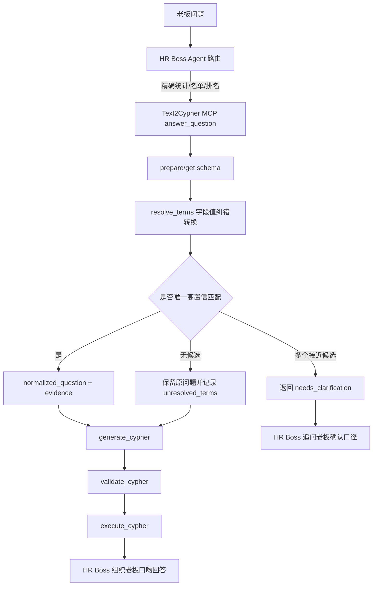

# HR Boss 字段值纠错转换模块方案

## 目标

在 HR Boss Agent 回答老板问题之前，增加一个“字段值纠错转换”能力。它负责把老板口语中的公司、部门、岗位、职称、证书、项目等业务词，先映射到 Neo4j 中真实存在的字段值，再进入 Text2Cypher 生成查询。

这个模块的目标不是替代 Text2Cypher，而是给 Text2Cypher 提供更可靠的上下文，减少以下问题：

- 老板说简称，图谱里存的是全称。
- 老板说俗称，图谱里存的是正式字段值。
- 老板输入错别字或不完整名称。
- 同一个词可能命中多个公司、部门或岗位，模型直接猜导致查错。
- Text2Cypher 生成的 Cypher 字段对了，但 literal 值不匹配，最终查不到结果。

推荐落点：在 `text2cypher` MCP 内部新增 term resolver，并让 `answer_question()` 默认集成该能力。

## Agent 内部业务流

HR Boss Agent 没有手写的业务状态机。它是通过 LangChain/LangGraph `create_agent()` 创建的工具调用循环。

主要模块：

| 模块 | 职责 |
| --- | --- |
| `backend/app/gateway/services.py` | 接收 run 请求，标准化 input/config，注入 `assistant_id` 对应的 `agent_name` |
| `backend/packages/harness/deerflow/runtime/runs/worker.py` | 执行 `agent.astream()` 并推送 stream 事件 |
| `backend/packages/harness/deerflow/agents/lead_agent/agent.py` | 根据 `agent_name` 创建模型、工具、middleware、prompt |
| `backend/packages/harness/deerflow/agents/lead_agent/prompt.py` | 注入 `SOUL.md`、skill、memory、系统约束 |
| `backend/packages/harness/deerflow/tools/tools.py` | 加载内置工具和 MCP 工具，并按 agent 配置过滤 MCP |
| `backend/.deer-flow/agents/hr-boss-agent/config.yaml` | 指定 HR Boss Agent 使用 `text2cypher` 和 `hr-graphrag-qa` |
| `backend/.deer-flow/agents/hr-boss-agent/SOUL.md` | 定义 HR Boss Agent 的路由与回答风格 |
| `skills/custom/hr-boss/SKILL.md` | 定义 HR Boss 编排规则 |

现有业务流：

```text
老板问题
-> DeerFlow Gateway
-> hr-boss-agent
-> 加载 SOUL.md + hr-boss skill
-> 模型判断走 Text2Cypher 还是 GraphRAG
-> 调 MCP 工具
-> 工具返回结构化结果
-> 模型转写成 HR 口吻回复
```

## 当前 Text2Cypher MCP 能力

Text2Cypher MCP 当前工具在：

- `D:/study/my-mcp/text2cypher/text2cypher/adapters/mcp/tools.py`
- `D:/study/my-mcp/text2cypher/text2cypher/adapters/mcp/server.py`

当前暴露工具：

```text
prepare_schema
get_schema
generate_cypher
validate_cypher
execute_cypher
answer_question
```

`answer_question()` 内部阶段在：

- `D:/study/my-mcp/text2cypher/text2cypher/core/engine.py`

当前流转：

```text
get_schema
-> generate_cypher
-> validate_cypher
-> execute_cypher
-> validation repair
-> quality repair
```

当前缺口：

- 没有“字段值候选查询”工具。
- 没有“术语归一化 / 纠错转换”结构。
- `answer_question()` 直接把原始问题送给生成器，容易把口语词、简称、错别字当成真实字段值。

## 推荐架构

新增一个 Text2Cypher 内部模块：

```text
text2cypher/core/term_resolver.py
```

并新增一个 MCP 工具：

```text
text2cypher_resolve_terms(question)
```

同时让现有 `answer_question()` 默认执行：

```text
schema ready
-> resolve_terms
-> build normalized_question + evidence
-> generate_cypher
-> validate_cypher
-> execute_cypher
-> repair
```

### 为什么放在 Text2Cypher MCP 内部

推荐放在 Text2Cypher MCP 内部，而不是只放在 HR Boss Agent prompt 中，原因如下：

- 字段值候选来自 Neo4j，MCP 已经持有 Neo4j 连接配置。
- 纠错结果要直接影响 Cypher 生成，离生成器越近越稳定。
- `answer_question()` 是 HR Boss 常规问答的主入口，内部集成后无需依赖大模型每次主动多调一个工具。
- 评测可以直接检查 `answer_question()` 返回的 `term_resolution`，可观测性更好。
- 低层工具链仍然可以单独调用 `resolve_terms` 做调试。

## 新增业务阶段

建议把 Text2Cypher 精确查询扩展为以下业务阶段：

```text
1. Schema 准备
2. 字段值候选解析
3. 术语纠错转换
4. Cypher 生成
5. Cypher 校验
6. Cypher 执行
7. 质量修复
8. HR Boss 汇报式回答
```

Mermaid 视图：



## 字段值候选白名单

不要开放任意 label/property 查询。建议先做白名单。

第一版白名单：

| 业务词类型 | Neo4j Label | Property | 查询策略 |
| --- | --- | --- | --- |
| 公司/组织 | `Organization` | `org_name` | 精确、包含、模糊 |
| 部门 | `Department` | `department_name` | 精确、包含、模糊 |
| 岗位 | `Position` | `position_name` | 精确、包含、模糊 |
| 职称 | `Title` | `title_name` 或 schema 中实际职称字段 | 精确、包含、模糊 |
| 证书 | 证书相关 Label | 证书名称字段 | 精确、包含、模糊 |
| 项目 | 项目相关 Label | 项目名称字段 | 精确、包含、模糊 |
| 员工 | `Employee` | `employee_name` / `employee_id` | 不全量枚举，只按输入片段查 |

说明：

- 具体字段名必须以 `get_schema()` 返回的结构化 schema 为准。
- 第一版不要试图覆盖所有属性，先覆盖老板查询中高频、易错、会影响 Cypher literal 的字段。
- 员工姓名属于高基数字段，不能无条件 `DISTINCT employee_name` 全表枚举。

## 查询策略

候选值查询不要“一开始查所有字段值”，而是根据问题中抽取出的疑似业务词定向查。

建议策略：

1. 先做轻量词提取。
   - 用规则识别明显关键词：公司、部门、岗位、职称、证书、项目、人名。
   - 对短问题保留连续中文名词片段。
   - 对包含“火炬电子”“技术部”“高工”等典型简称的词单独抽取。

2. 对每个疑似词，只查白名单字段。

3. 每个字段候选限制数量：

```cypher
MATCH (n:Organization)
WHERE n.org_name IS NOT NULL
  AND toLower(toString(n.org_name)) CONTAINS toLower($term)
RETURN DISTINCT n.org_name AS value
LIMIT 20
```

4. 对候选打分。

建议第一版评分：

| 信号 | 分值倾向 |
| --- | --- |
| 完全相等 | 最高 |
| 去空格/大小写/全半角后相等 | 高 |
| 候选包含用户词 | 中高 |
| 用户词包含候选 | 中 |
| 编辑距离接近 | 中 |
| 多个候选分数接近 | 降低置信度，需要澄清 |

5. 只在唯一高置信时自动替换。

自动替换条件建议：

```text
top_score >= 0.85
and top_score - second_score >= 0.10
```

否则返回 `needs_clarification=true`。

## 新增数据结构

建议在 `text2cypher/core/models.py` 新增：

```python
class TermCandidate(BaseModel):
    label: str
    property: str
    value: str
    score: float
    match_type: str


class TermMapping(BaseModel):
    source: str
    label: str
    property: str
    matched_value: str | None = None
    confidence: float = 0.0
    candidates: list[TermCandidate] = Field(default_factory=list)
    status: str


class TermResolutionResult(BaseModel):
    question: str
    normalized_question: str
    mappings: list[TermMapping] = Field(default_factory=list)
    unresolved_terms: list[str] = Field(default_factory=list)
    needs_clarification: bool = False
    clarification_question: str | None = None
```

`status` 建议枚举值：

```text
resolved
ambiguous
unresolved
skipped
```

同时扩展：

```python
class AnswerQuestionResult(BaseModel):
    ...
    term_resolution: TermResolutionResult | None = None
```

## MCP 工具设计

新增工具：

```text
resolve_terms(question: str, max_candidates: int = 20)
```

MCP 暴露名会带 server 前缀：

```text
text2cypher_resolve_terms
```

返回示例：

```json
{
  "question": "火炬电子现在有多少员工？",
  "normalized_question": "福建火炬电子科技股份有限公司现在有多少员工？",
  "mappings": [
    {
      "source": "火炬电子",
      "label": "Organization",
      "property": "org_name",
      "matched_value": "福建火炬电子科技股份有限公司",
      "confidence": 0.96,
      "status": "resolved",
      "candidates": [
        {
          "label": "Organization",
          "property": "org_name",
          "value": "福建火炬电子科技股份有限公司",
          "score": 0.96,
          "match_type": "contains"
        }
      ]
    }
  ],
  "unresolved_terms": [],
  "needs_clarification": false,
  "clarification_question": null
}
```

歧义返回示例：

```json
{
  "question": "技术部现在有多少人？",
  "normalized_question": "技术部现在有多少人？",
  "mappings": [
    {
      "source": "技术部",
      "label": "Department",
      "property": "department_name",
      "matched_value": null,
      "confidence": 0.0,
      "status": "ambiguous",
      "candidates": [
        {"label": "Department", "property": "department_name", "value": "技术中心", "score": 0.82, "match_type": "fuzzy"},
        {"label": "Department", "property": "department_name", "value": "技术开发部", "score": 0.80, "match_type": "contains"}
      ]
    }
  ],
  "unresolved_terms": [],
  "needs_clarification": true,
  "clarification_question": "老板，技术部可能对应“技术中心”或“技术开发部”，您想按哪个口径看？"
}
```

## `answer_question()` 集成方式

推荐修改 `Text2CypherEngine.answer_question()`：

```text
schema = get_schema()
term_resolution = resolver.resolve(question, schema)

if term_resolution.needs_clarification:
    return AnswerQuestionResult(
        generation=None,
        validation=None,
        execution=None,
        term_resolution=term_resolution,
        needs_clarification=True
    )

effective_question = term_resolution.normalized_question
evidence = append_term_resolution_evidence(evidence, term_resolution)
generation = generator.generate(question=effective_question, schema_text=schema.schema_text, evidence=evidence)
...
```

为了兼容当前 `AnswerQuestionResult` 的必填字段，可以选择：

1. 第一版不让 `answer_question()` 中断，只把 `term_resolution` 作为 evidence 注入；歧义时仍让 HR Agent 根据返回内容追问。
2. 第二版再把 `generation`、`validation` 改成可选，并显式支持 `needs_clarification`。

推荐第一版选择兼容方案，减少破坏面。

## Evidence 注入格式

把纠错转换结果追加到生成器 evidence 中，格式建议稳定、可读、少废话：

```text
Term resolution:
- User term "火炬电子" maps to Organization.org_name = "福建火炬电子科技股份有限公司" with confidence 0.96.
- Use the mapped canonical value in Cypher literals.
```

歧义时：

```text
Term resolution:
- User term "技术部" is ambiguous for Department.department_name.
- Candidates: "技术中心", "技术开发部".
- Do not assume one candidate without clarification.
```

## HR Boss Agent 侧规则调整

DeerFlow 侧不需要新增状态机。只需要补充 `SOUL.md` 和 `skills/custom/hr-boss/SKILL.md`：

```text
当 Text2Cypher 返回 term_resolution.needs_clarification=true，最终回答应先向老板确认候选口径，不要继续编造查询结论。

当 Text2Cypher 返回 term_resolution.mappings，最终回答可用自然语言说明“我已按系统中的正式名称口径匹配为 XXX”，但不要展示内部 JSON。
```

如果新增了单独工具 `text2cypher_resolve_terms`，低层调试路径可以变成：

```text
text2cypher_prepare_schema
-> text2cypher_resolve_terms
-> text2cypher_get_schema
-> text2cypher_generate_cypher
-> text2cypher_validate_cypher
-> text2cypher_execute_cypher
```

普通老板问答仍优先：

```text
text2cypher_answer_question
```

## 安全与性能约束

### 安全约束

- 字段值查询只允许白名单 label/property。
- 不接受用户传入任意 Cypher。
- Resolver 内部构造 Cypher 时必须使用参数 `$term`，不要拼接 literal。
- 禁止写操作。
- 禁止调用 APOC 或其他过程。

### 性能约束

- 每个疑似词最多查 6-8 个白名单字段。
- 每个字段 `LIMIT 20` 或 `LIMIT 50`。
- 对低基数字段可以缓存 `DISTINCT` 值。
- 对高基数字段只按输入片段查询，不做全量缓存。
- 单次问题 resolver 总耗时建议控制在 1 秒以内。

### 缓存策略

第一版建议：

- schema 仍复用现有 `SchemaService` 缓存。
- 低基数字段候选可以进程内 TTL 缓存。
- 高基数字段不缓存全量值。

可缓存字段：

```text
Organization.org_name
Department.department_name
Position.position_name
Title.title_name
```

不建议全量缓存字段：

```text
Employee.employee_name
Project.project_name
```

## 错误处理策略

| 场景 | 行为 |
| --- | --- |
| Resolver 查询失败 | 不阻塞主查询，记录 `term_resolution_error`，保留原问题继续生成 |
| 没有候选 | 不替换，记录 unresolved term |
| 多个候选接近 | 返回歧义候选，由 HR Boss 追问老板 |
| 唯一高置信候选 | 自动替换为 canonical value |
| schema 中不存在白名单字段 | 跳过该字段，并在 diagnostics 中记录 |
| 候选值为空/null/未填写 | 过滤掉，不作为候选 |

## 评测设计

新增一个评测 track：

```text
term_resolution.strict
```

样例：

```jsonl
{"id":"term_001","category":"organization_alias","question":"火炬电子现在有多少员工？","expected":"应把火炬电子映射为福建火炬电子科技股份有限公司，并按当前员工口径查询"}
{"id":"term_002","category":"title_alias","question":"高工现在有多少人？","expected":"应识别高工为高级工程师职称，不应按岗位查询"}
{"id":"term_003","category":"department_ambiguous","question":"技术部现在有多少人？","expected":"如果存在多个技术相关部门，应追问确认，不应直接猜"}
{"id":"term_004","category":"unknown_value","question":"星火事业部现在有多少人？","expected":"如果图谱没有该部门候选，应说明未命中或追问，不应编造部门"}
```

评测断言：

- `tool_calls` 中出现 `text2cypher_resolve_terms`，或 `text2cypher_answer_question` 返回 `term_resolution`。
- `generated_cypher` 使用 canonical 字段值。
- 默认员工问题仍包含当前员工过滤：

```cypher
(e)-[:CURRENTLY_IN_DEPARTMENT]->(:Department)
OR (e)-[:CURRENTLY_IN_POSITION]->(:Position)
```

- 歧义问题不应生成随意选定候选值的最终结论。

## 实施步骤

### 第一阶段：MCP 内部 resolver

修改 `D:/study/my-mcp/text2cypher`：

- 新增 `text2cypher/core/term_resolver.py`
- 扩展 `text2cypher/core/models.py`
- 扩展 `Text2CypherEngine.__init__`
- 新增 `Text2CypherEngine.resolve_terms()`
- 在 `answer_question()` 内部调用 resolver
- 在 `text2cypher/adapters/mcp/tools.py` 暴露 `resolve_terms`
- 在 `text2cypher/adapters/mcp/server.py` 注册工具

### 第二阶段：HR Boss prompt 对齐

修改 `D:/study/deer-flow`：

- `backend/.deer-flow/agents/hr-boss-agent/SOUL.md`
- `skills/custom/hr-boss/SKILL.md`
- `backend/.deer-flow/agents/hr-boss-agent/text2cypher-profile.md`

补充：

- 遇到 `term_resolution.needs_clarification` 时必须追问。
- 遇到 canonical mapping 时按正式口径回答。
- 当前员工口径继续由 profile 负责。

### 第三阶段：评测与可观测性

修改 `D:/study/deer-flow`：

- `backend/scripts/run_hr_boss_eval.py`
- `backend/tests/test_hr_boss_eval_runner.py`
- `docs/evaluation/hr-boss/term_resolution.strict.jsonl`

增加：

- `term_resolution` trace 提取。
- `resolve_terms` 工具链记录。
- alias、歧义、未命中、当前员工口径组合用例。

## 推荐第一版交付范围

第一版只做高价值范围：

- 支持组织、部门、岗位、职称四类字段。
- 支持 `resolve_terms` 独立工具。
- 支持 `answer_question()` 内部自动 resolver。
- 支持唯一高置信自动替换。
- 支持歧义候选返回，但不强制重构 `AnswerQuestionResult` 为中断式结果。
- 支持评测输出 `term_resolution`。

第一版暂不做：

- 全字段自动枚举。
- 员工姓名全量索引。
- 复杂中文分词服务。
- 跨库多数据源 entity linking。
- 持久化候选索引。

## 验收标准

功能验收：

- “火炬电子现在有多少员工？”能映射到“福建火炬电子科技股份有限公司”。
- “高工有哪些？”能优先映射为职称“高级工程师”，不是岗位。
- “技术部现在有多少人？”如果存在多个候选，应追问确认。
- 未命中字段值时不编造。
- 默认员工查询仍遵守当前员工口径。

工程验收：

- Text2Cypher MCP 单元测试覆盖 resolver 打分、白名单、歧义、未命中。
- MCP server 测试覆盖新工具注册。
- HR Boss eval runner 能捕获 `term_resolution`。
- 现有 `text2cypher.strict`、`boss.e2e` 路径不破坏。

## 风险与取舍

最大风险是“误纠错”：系统把老板原词自动替换成错误候选，导致查询结果看起来正常但业务口径错了。

应对策略：

- 只在唯一高置信时自动替换。
- 多候选接近时追问，不猜。
- 在最终回答中可以轻量说明“我按系统中的正式名称 XXX 查询”。
- 评测中加入歧义样例，防止模型绕过追问。

第二个风险是性能。如果每次问题都扫大量字段，会拖慢回答。

应对策略：

- 白名单字段。
- LIMIT。
- 低基数字段缓存。
- 高基数字段只做定向查询。

第三个风险是职责混乱。如果 DeerFlow Agent 自己拼字段查询，会让 HR Boss prompt 变复杂，也难以复用。

应对策略：

- DeerFlow 只负责编排和回答口吻。
- Text2Cypher MCP 负责 schema、字段值解析、Cypher 生成、校验和执行。

